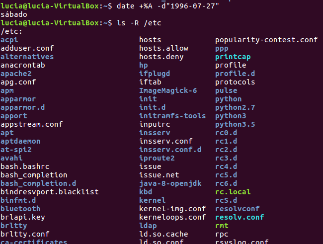

# Comando y Scripting en Linux
Ejercicios de comandos y scripting para la asignatura de Sistemas Informáticos

## Usando los comandos de Linux

1. Si no lo estás, sitúate en tu directorio personal y muestra un listado de su contenido.
``` console
> ls
```


2. Sin salir del directorio actual, muestra un listado del directorio que está justamente a un nivel superior

``` console
> ls ..
```


3. Utiliza el comando date para mostrar en pantalla el día de la semana en que naciste. Desplázate hasta la carpeta /etc y muestra un listado de su contenido, y de todos los directorios que se encuentran en su interior, utilizando exactamente dos comandos.

``` console
> date +%A -d"1996-07-27"
> ls -R /etc
```


4. Muestra todos los archivos del directorio usr/bin/X11 ordenados por fecha de modificación. Debera aparecer únicamente el nombre de cada fichero, sin ninguna otra información adicional.

``` console
> ls -t ../../usr/bin/X11
```


5. Muestra toda la información de los archivos del directorio /etc ordenados por tamaño (de menos a mayor). El tamaño debe aparecer expresado en Kb, Mb, Gb...

``` console
> ls -Sr -hs -l /etc
```


6. Lista el contenido del directorio /bin mostrando únicamente el nombre del archivo y el tamaño, expresando este último en Kb, Mb, Gb, etc.

``` console
> ls -s -h /bin
```


7. Muestra el contenido del archivo /etc/fstab

``` console
> cat /etc/fstab
```


8. Localiza en el sistema los archivos de tu máquina el archivo bash.bashrc

``` console
> locate bash.bashrc
```


9. Muestra las últimas 5 líneas del archivo bash.bashrc de la ruta más corta

``` console
> tail -n 5 /etc/bash.bashrc
```


10. Accede a tu irectorio personal y de ahí al escritorio, donde deberás crear una estructura de directorios usando el método más abreviado posible.

``` console
> mkdir -p Escritorio/trabajo/{documento,imagenes/{otras,personales},musica,presentaciones,video}
```


11. Dentro del directorio trabajo/video crea un documento llamado peliculas_favoritas.txt y establece la fecha de su última modificación a 1 de enero de 2018, a las 23:55.

``` console
> vi Escritorio/trabajo/video/peliculas_favoritas.txt
> touch -t "201801012355"
```


12. Edita el archivo anterior con nano añadiendo, por cada línea y separados por punto y coma, título, género y director de tus películas favoritas (mínimo 5).

``` console
> nano Escritorio/trabajo/video/peliculas_favoritas.txt
> cat Escritorio/trabajo/video/peliculas_favoritas.txt
```


13. Supòniendo que no conocemos a priori el contenido del archivo anterior, muestra toda la información que contiene excepto la primera línea.

``` console
> tail n+2 Escritorio/trabajo/video/peliculas_favoritas.txt
```


14. Descarga el archivo .tar proporcionado y guárdalo en tu directorio home. Hecho esto, y sin moverte del directorio anterior, desempaqueta su contenido dentro del directorio trabajo/.

``` console
> tar -C trabajo -xvf ../paquete.tar
```


15. Visualiza elcontenido del paquete para comprobar que se ha desepaquetado correctamente

``` console
> tar -tf ../paquete.tar
```


16. Sitúate en el directorio documentos y, seguidamente, mueve los archivos que acabas de descargar que comienzan por doc y tienen extensión .txt

``` console
> cd trabajo/documento
> mv ../doc*.txt .
```


17. Sitúate en el directorio trabajo y mueve los archivos de las imágenes a la carpeta otras/.

``` console
> cd ..
> mv *.png imagenes/otras
```


18. Mueve al directorio presentaciones/ los archivos de texto cuyo nombre acaben con una letra.

``` console
> mv *[a-z].txt presentaciones
```


19. Adquiere permisos de superusuario.

``` console
> sudo passwd root
> su
```


20. Descomprime el archivo proceso.tar y cambia el propietario y el grupo del archivo para que pertenezca únicamente a root.

``` console
> tar -xvf proceso.tar
> chown root:root proceso[0-9]*
> ls -l proceso[0-9]*
```


21. Cambia ahora los permisos del archivo proceso para uqe tan solo el propietario tenga control para leer, modificar y ejecutar el archivo.

``` console
> chmod 700 proceso[0-9]*
> ls -l proceso[0-9]*
```


22. Ejecuta ahora el programa proceso y comprueba que no termina

#### No puedo ejecutarlo

27. Abandona la sesión de superadministrador sin cerrar la terminal

``` console
> exit
```


28. Averigua a qué grupo pertenece tu usuario.

``` console
> groups
```


29. Muestra únicamente el número de líneas del archivo comandos .txt

``` console
> wc -l < comandos.txt
```


30. Muestra nuevamente el número de líneas del archivo anterior, pero utilizando el comando grep combinado, si es necesario, con otros comandos.

``` console
> grep -w "*" -cv comandos.txt
```


31. Muestra en pantalla un listado de todos los archivos .h que se encuentran en el directorio /usr/include

``` console
> find -L ../../../../usr/include/ -name "*.h"
```


32. Copia los archivos ttwist en la carpeta documentos

``` console
> cp ../../ttwist* documento
```


33. Situate en el directorio trabajo/documentos y localiza las líneas que comienzan con una palabra que termine el h. Muestra únicamente las ocurrencias y no la línea completa.

``` console
> cd documento
> grep -o '^\w*ch\b' *.txt
```


34. Escribe un comando de una sola línea que muestre po pantalla completa el número de líneas de cada trabalenguas cuya palabra final no acabe en vocal (no importa que termine en un signo de puntuación).

``` console
> grep -c '[a-z^aeiou][[:punct:]]*$' ttwist*.txt
```


35. Muestra todas las líneas que contengan un signo de puntuación en cualquiera de los trabalenguas.

``` console
> grep -h '[[:punct:]+]' ttwist*.txt
```


36. Muestra únicamente aquellas palabras del segundo trabalenguas que contengan exactamente dos vocales seguidas.

``` console
> egrep -o '\w*[aeiou]{2}\w*\b' ttwist_02.txt
```


37. Crea un fichero con nombre ej39.txt con aquellas líneas que contienen palabras con cuatro o más consonantes consecutivas. El archivo debe contener las líneas, pero no el nombre del archivo-

``` console
> egrep -h '[^aeiou[:space:][:punct:]]{4,}' ttwist*.txt > ej39.txt
```


38. Repite el ejercicio anterior teniendo en cuenta que el archivo (ej40.txt) debe contener, de las dos últimas líneas de cada trabalenguas, aquellas que contengan una sola consonante seguida de dos vocales consecutivas.

``` console
> tail -n2 ttwist*.txt | grep -E "[^aeiou]{1}[aeiou]{2}" > ej40.txt
```


39. Muestra únicamente el PID del proceso gnome-panel.

#### Lo muestro del gnome-terminal porque no tengo gnome-panel

``` console
> top -p `pgrep -d ',' "terminal"`
```


40. Muestra en pantalla el contenido del archivo comandos.txt siempre que en su interior se encuentre el comando man.

``` console
> cat ../comandos.txt | grep -z "man"
```


41. Muestra todos los archivos .conf del directorio /etc cuyo nombre no comience por vocal. Deberán visualizarse ordenados por tamaño (de menos a mayor) junto con el resto de características.

``` console
> ls -Sr -lhs ../../../../../etc/*.conf | egrep 'c/[^aeiou]+' > e33.txt
```


42. Busca en el sistema todos los directorios con extensión acabada en un dígito. Vuelca el resultado en ej 34.txt.

``` console
> find ../../../../../ -type h -name "*[0-9]" > ej34.txt
```


43. Ejecuta el comando anterior teniendo en cuenta que no deberán mostrarse por pantalla los errores producidos por el comando.

``` console
> find ../../../../../ -type d -name "*[0-9]" 2>/dev/null > ej34.txt
```


44. Calcula y muestra el tiempo que tarda en ejecutarse un ping a la dirección de google.es, teniendo en cuenta que deberán enviarse paquetes en intervalos de 0.25 segundos y que el total de paquetes enviados será de 25 segundos. Adicinalmente, cuando se haga un ping, se deberá escuchar una campanita.

```  console
ping google.es -a -i 0.25
```


